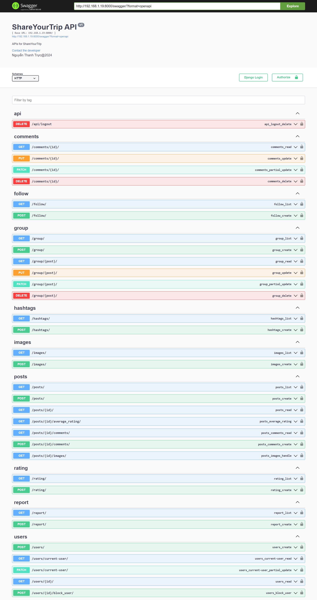

# Share Your Trip Backend

## Overview

**Share Your Trip** is a backend system that provides APIs for clients to handle tasks related to post management, user interaction and tasks related to sharing journeys. This system provides features for objects such as users and administrators to create a complete system.

## Database
<p align="center">
    
</p>

## Installation
*This readme contains installations and usages for Django & DjangoREST framework*

To ensure the project runs, please install [python](https://www.python.org/downloads/)

```bash
# Install packages in requirement.txt
pip install requirements.txt
```
Create a .env file in the root directory of your application, then fill in the following information.
```bash
SECRET_KEY=your_secret_django_key
DEBUG=True
DATABASE_NAME=your_database_name
DATABASE_USER=your_database_user #default: ROOT
DATABASE_PASSWORD=your_database_password
DATABASE_HOST=your_database_host #default: localhost

CLOUDINARY_CLOUD_NAME=your_cloudinay_cloud_name
CLOUDINARY_API_KEY=your_cloudinay_api_key
CLOUDINARY_API_SECRET=your_cloudinay_api_secret

CLIENT_ID=your_client_id
CLIENT_SECRET=your_client_secret
```
## Usage
To launch the application, execute the following command: (Note that you must be in the ShareYourTrip folder)
```bash
python manage.py runserver 0.0.0.0:8000
```
Check your IP address, application is running at your IP address with port 8000
```bash
# Open terminal, check your IP address
ip config
```
Application interface after running
<p align="center">
    
</p>

List of APIs listed in swagger
<p align="center">
    
</p>
